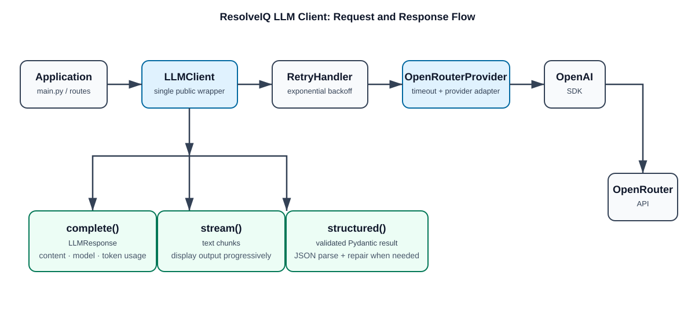

# Codebase Intelligence Copilot Backend

The backend currently contains a reusable LLM client built on the OpenAI Python SDK and configured to call OpenRouter. It supports normal completions, streamed responses, validated JSON responses, retry handling, and token-usage reporting.

## Setup

Create and activate a virtual environment, then install the dependencies:

```bash
cd "/Users/himanshujha/Downloads/ResolveIQ/backend "
python3 -m venv ../venv
source ../venv/bin/activate
pip install -r requirements`.txt
```

Create a `.env` file in `backend ` (the folder currently has a trailing space) with your OpenRouter key:

```env
OPENROUTER_API_KEY=your_openrouter_api_key
```

Do not commit `.env` or paste the key into source files.

## Run the example

Run the application as a package from the directory above `app`:

```bash
cd "/Users/himanshujha/Downloads/ResolveIQ/backend "
python -m app.main
```

Do not run `python main.py` while inside `app/`: imports such as `from app...` require Python to see the directory containing `app` on its module path.

## LLM client design

`LLMClient` uses composition: it holds a provider instance rather than inheriting from a provider.

```text
LLMClient
  ├── OpenRouterProvider (implements LLMProvider)
  ├── RetryHandler
  ├── TikTokenCounter
  └── StructuredOutputParser
```

### Request and response flow



- `providers/base.py` defines the provider contract: `complete()` and `stream()`.
- `providers/openrouter.py` makes OpenRouter-specific API requests and converts normal completions to `LLMResponse`.
- `types.py` defines the shared `LLMResponse` and `TokenUsage` data types.
- `retry.py` retries failed completion and stream-start requests using exponential backoff.
- `streaming.py` extracts text deltas from streamed OpenRouter chunks.
- `structured.py` parses model JSON into a Pydantic model.
- `token_counter.py` estimates token count locally. For non-OpenAI models such as Qwen, it falls back to `cl100k_base`, so its count is an estimate rather than the provider's exact value.

## Standard completion and provider token usage

```python
from app.llm_client.config import LLM_config
from app.llm_client.llm_client import create_llm_client

llm_client = create_llm_client(LLM_config)

response = llm_client.complete(
    messages=[
        {"role": "user", "content": "Explain FastAPI in one paragraph."},
    ],
    max_tokens=300,
)

print(response.content)
print(response.model)

if response.usage:
    print(response.usage.prompt_tokens)
    print(response.usage.completion_tokens)
    print(response.usage.total_tokens)
```

`response.usage` is returned by OpenRouter and is the preferred source for token usage after a request.

## Structured JSON output

Define a Pydantic model that exactly matches the JSON you want from the LLM. Metadata such as model name and token usage should remain on `LLMResponse`, not be added to this content schema.

```python
from pydantic import BaseModel

class Explanation(BaseModel):
    explanation: str

result = llm_client.structured(
    messages=[
        {
            "role": "system",
            "content": 'Return only valid JSON: {"explanation": "..."}',
        },
        {
            "role": "user",
            "content": "Explain FastAPI in one paragraph.",
        },
    ],
    response_model=Explanation,
    max_tokens=300,
)

print(result.explanation)
```

The prompt must request valid JSON with the same fields as the Pydantic model. If the first response is not valid JSON or does not satisfy the schema, `LLMClient` makes one schema-guided repair request by default. It then raises `StructuredOutputError` if the repaired response is still invalid. Configure `structured_repair_attempts` in `LLMConfig` to use zero to three repair attempts.

If both structured content and token usage are needed for one request, use `complete()` and parse its content directly:

```python
response = llm_client.complete(messages, max_tokens=300)
result = llm_client.structured_parser.parse(response.content, Explanation)

print(result.explanation)
print(response.usage.total_tokens if response.usage else "Usage unavailable")
```

## Versioned prompts

Prompts are stored as versioned YAML assets so prompt changes can be tested, deployed, and rolled back independently of application logic. The goal is to keep every released prompt version immutable: create a new file such as `v2.yaml` instead of modifying `v1.yaml`.

```text
app/prompts/
  fastapi_explanation/
    v1.yaml
    v2.yaml
```

`PromptRegistry` loads and validates a prompt by its ID and version. `render_message()` then replaces named placeholders with request-specific values.

```python
messages = render_message(
    "fastapi_explanation",
    "v1",
    topic="dependency injection in FastAPI",
)
```

For production, keep the selected version in configuration (for example, `FASTAPI_EXPLANATION_PROMPT_VERSION=v1`) rather than hardcoding it in every route. Deploy and test a new version first, switch the configuration when ready, and roll back by selecting the previous version.

Prompt variables use Python's `str.format()` syntax. Escape literal JSON braces by doubling them, while leaving replacement variables as single braces:

```yaml
messages:
  - role: system
    content: |
      Return only valid JSON:
      {{"explanation": "..."}}
  - role: user
    content: |
      Explain this topic in one paragraph: {topic}
```

## Streaming

`stream()` yields text fragments as the provider sends them:

```python
for text in llm_client.stream(
    [{"role": "user", "content": "Explain FastAPI in one paragraph."}],
    max_tokens=300,
):
    print(text, end="", flush=True)
```

## Configuration

`app/llm_client/config.py` stores the model configuration, request timeout, retry policy, and structured-output repair count. The current example uses `qwen/qwen3.8-27b` through OpenRouter. The timeout is passed to both completion and streaming API calls. Keep `max_tokens` modest (for example, 100–500 for short answers): requesting a very large completion can result in an OpenRouter `402` error when the available credit cannot cover it
